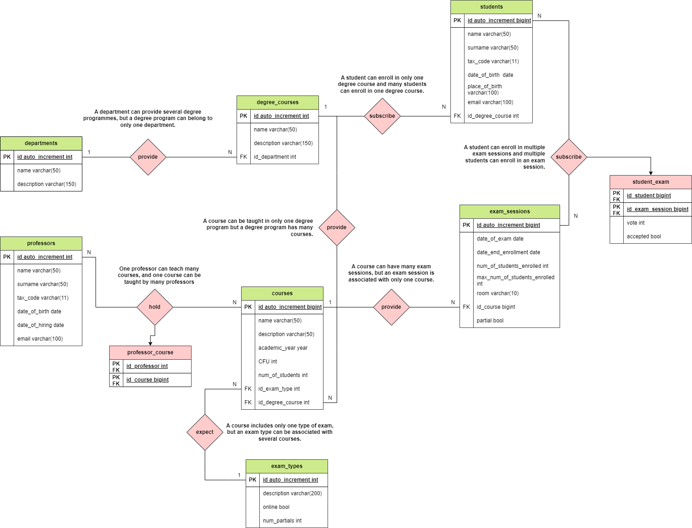

# University database

## Milestones

Model the structure of a database to store all data relating to a university:
- there are several Departments (e.g. Humanities, Mathematics, Engineering, etc.);
- each Department offers several Degree Courses (e.g. Civilization and Classical Literature, Computer Science, Electronic Engineering, etc.)
- each Degree Course includes several Courses (e.g.: Latin Literature, Operating Systems 1, Mathematical Analysis 2 etc.);
- each Course can be held by different Teachers;
- each course includes several exam sessions;
- each Student is enrolled in only one Degree Course;
- each Student can enroll in more than one exam session;
- for each exam session in which the student has participated, it is necessary to memorize the mark obtained, even if it is not sufficient.
Let's think about which entities (tables) to create for our database and then try to establish their relationships. Finally, let's define the columns and data types of each table.